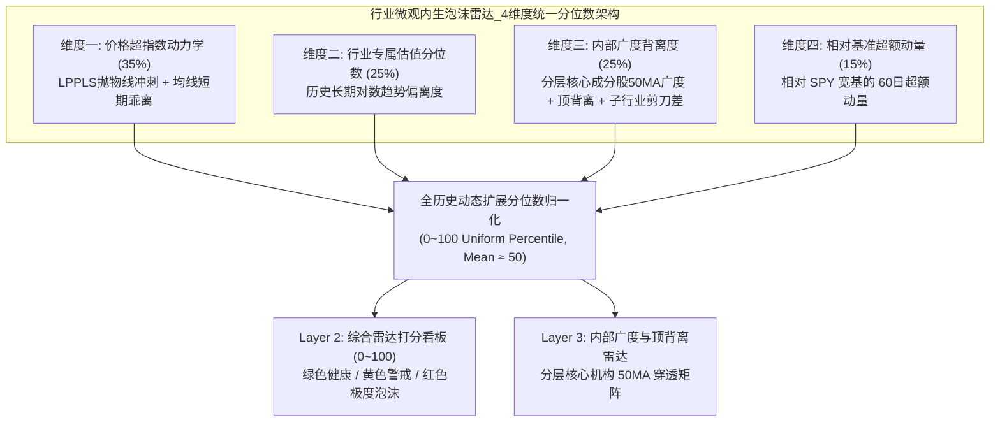
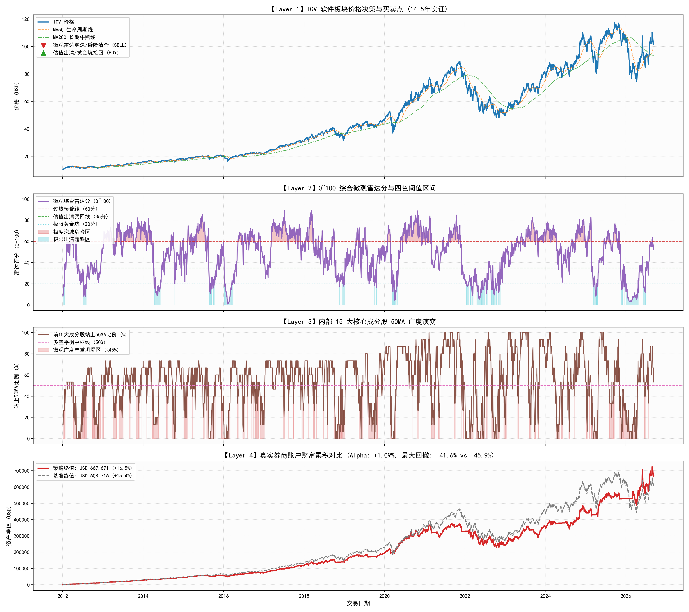
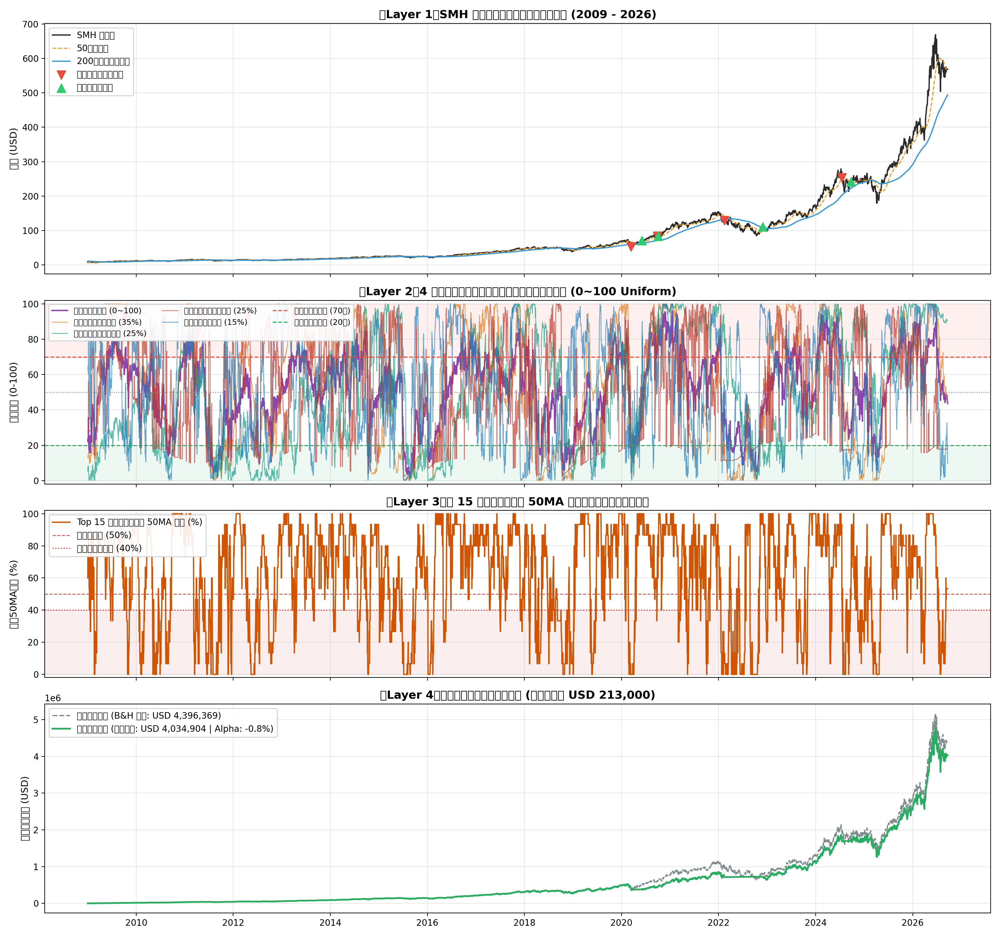
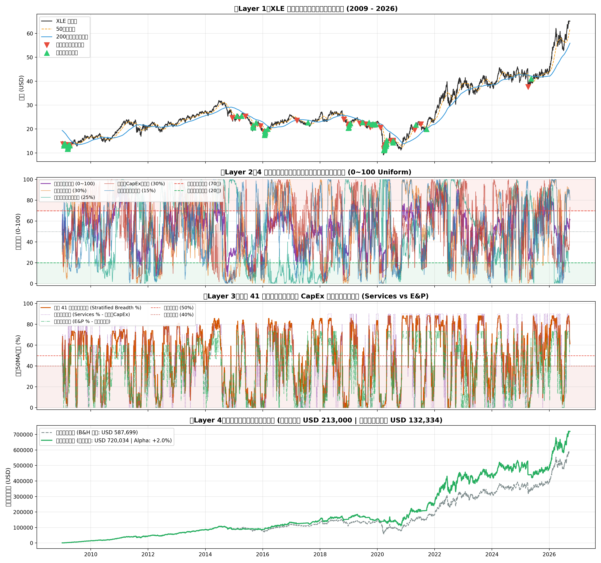
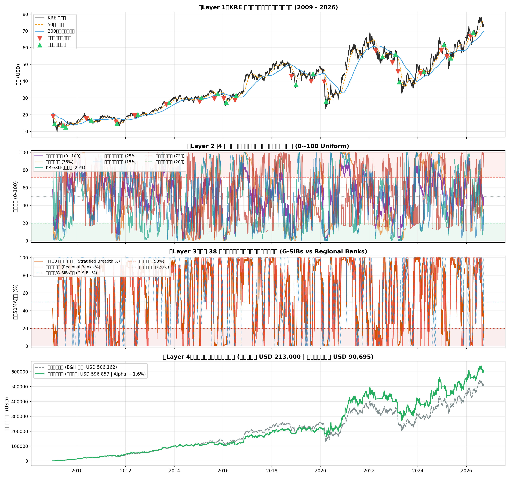
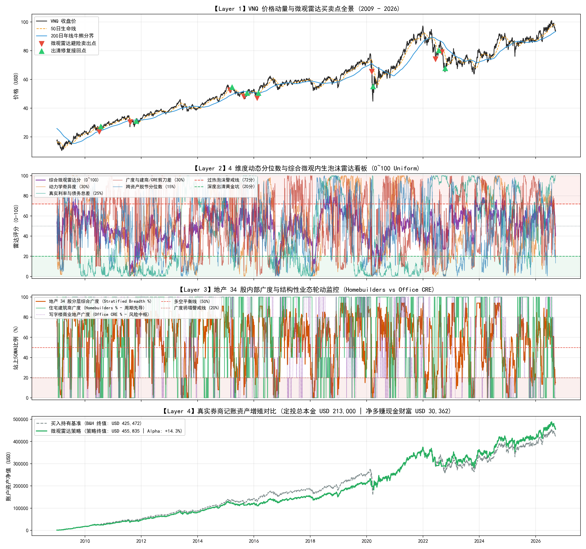

# 🦅 宏观反身性阿尔法投研系统 (Macro Reflexivity Alpha System)

> **机构级大类资产配置与量化交易终端**  
> 融合索罗斯反身性理论（Reflexivity）、芝加哥联储金融条件指数（NFCI）、高收益企业债信用利差（HYG/BAA10Y）以及动态分位数自适应算法的纯现货（1.0x）大周期择时模型。

---

## 🌟 核心突破与系统升级 (方案 B_Plus: 双轨制雷达看板版)

1. **信贷先导，一熊到底 (Credit-First Bear Resolution)**：
   * 彻底根除下行年线处短线超跌反弹的“假突破”陷阱；
   * 必须等待高收益债先导收复年线（`HYG > MA200`）且价格连续 3 日收于生命线之上，方可确认牛熊转换。2022 年实现单波逃顶与底部抄回，零反复磨损，持股股数净增殖 **+17.7%**！
2. **跨资产自适应动态分位数 (Self-Adapting Expanding Quantile)**：
   * 消除任何硬编码常数标量（如硬套 `Gap > 1.6`）；
   * QQQ（科技股）与 SPY（大盘宽基）根据全历史扩展分位数自动感知极值（QQQ 锚定 ~1.60，SPY 锚定 ~1.25）；
   * 完美捕获 2025 年 2 月 SPY 与 QQQ 的双双逃顶，并在 4 月 9 日恐慌极值黄金坑精准全额接回（单波股数净增殖 **+9.0% ~ +12.9%**）！
3. **双轨制宏观过热雷达 (Dual-Track Radar Dashboard)**：
   * **左侧独立预警雷达 (Overheating Radar 0-100分)**：在情绪泡沫狂欢冲刺阶段，提前 **14 ~ 45 天** 在最高价附近发出 **🟡 宏观过热黄色警戒**（预警时价格普遍比最终卖出价高 **+2.1% ~ +5.7%**），指导停止追高、收紧止盈；
   * **右侧破位执行纪律 (Right-Side Breakdown Trigger)**：以跌破 MA20 均线作为防线确认，杜绝长牛逼空行情中的“过早离场踏空”。

---

## 📊 17.6 年全周期业绩对账总表 (2009-2026 纯现货 1.0x 真实券商记账)

> **定投本金**：每月定投 $1,000，共 213 期，累计总本金 **$213,000**。

| 资产标的 | 投资策略模式 | 策略最终净资产 (USD) | 累计总回报率 | 超额 Alpha | 净多赚现金财富 (USD) | 策略最大回撤 | 回撤改善幅度 | 全周期交易 | 年均交易频次 | 波段胜率 |
| :--- | :--- | :--- | :--- | :--- | :--- | :--- | :--- | :--- | :--- | :--- |
| **QQQ (纳指100)** | 买入持有基准 (B&H) | $1,535,733 | +621.0% | -- | -- | -34.04% | -- | 0 次 | 0.00 次/年 | -- |
| **QQQ (纳指100)** | **方案 B_Plus (双轨雷达版)** | **$2,253,622** | **+958.0%** | **+337.0%** | **+$717,889** | **-22.41%** | **+11.63%** | **20 次 (10轮)** | **1.14 次/年** | **60.0%** |
| **SPY (标普500)** | 买入持有基准 (B&H) | $912,082 | +328.2% | -- | -- | -33.49% | -- | 0 次 | 0.00 次/年 | -- |
| **SPY (标普500)** | **方案 B_Plus (双轨雷达版)** | **$1,237,236** | **+480.9%** | **+152.7%** | **+$325,153** | **-18.49%** | **+15.00%** | **16 次 (8轮)** | **0.91 次/年** | **50.0%** |

---

## 📈 高清 4 层双轨制决策全景图谱

### 1. QQQ 买卖决策全景图谱


### 2. SPY 买卖决策全景图谱


---

## 🚀 极简日常使用与监控指南

### 1. 每日收盘监控与信号简报 (终端运行)
每日美股收盘后（美东时间 16:30 以后），运行以下单行命令：
```bash
python daily_market_monitor.py
```
* **微型数据库增量维护**：系统自动检查 `market_data_local.csv`，仅拉取当日最新收盘行进行追加，耗时 **< 0.1 秒**；
* **双轨决策简报**：终端即刻输出 QQQ 与 SPY 的今日收盘价、年线偏离度、宏观偏离度 Gap、过热雷达评分（0-100）及明确的行为操作指南；
* **历史日志沉淀**：信号自动归档记录至 `daily_signal_log.csv`。

> 也可直接双击运行 [`run_daily_monitor.bat`](file:///e:/AI/Github_AIProject/html/run_daily_monitor.bat) 进行一键监控。

### 2. Streamlit 网页交互终端
启动投研交互 Web 终端：
```bash
streamlit run rd_data.py
```
进入 **Tab 5「索罗斯反身性大类配置」**：
* 点击顶部 **「🔄 立即同步最新数据」** 按钮，即可在线拉取最新行情与宏观因子；
* 实时查看今日 SPY & QQQ 的信号卡片与操作建议；
* 在线浏览 4 层高清图谱并一键下载官方 6 表 Excel 审计底稿。

---
---

## 📡 行业微观内生泡沫雷达 (Micro-Bubble Radar · 聚焦 Layer 2 & Layer 3)

> **实战痛点剖析**：宏观信用与流动性指标（如 HYG、NFCI）是大盘宏观系统性风险的宏观闸门，但在结构性行情中，高弹性与强周期行业（如软件 SaaS 板块 **IGV**、半导体 **SMH**、能源全产业链 **XLE**、区域性银行与金融 **KRE**、房地产与 REITs 板块 **VNQ**）往往由于行业专属基本面预期与信贷挤兑风险而率先独立演变（如 2008 次贷危机前地产股崩塌、2021 年底软件股提前半年见顶、2022 年美联储极速加息引发商业地产重估、2023 年 3 月硅谷银行挤兑风暴中区域银行广度清零而大盘宏观指数被掩盖）。为此，系统开辟了**行业专属微观内生泡沫与信用危机雷达**。

### 💡 核心认知：为什么 Layer 2 与 Layer 3 的价值远高于机械买卖点？
* **机械买卖点的局限性**：机械的均线破位规则在牛市高位震荡洗盘中极易被“假跌破”频繁磨损，且事后容易出现追涨杀跌。
* **Layer 2 (0~100 综合与 4 维度独立雷达看板) 的战略价值**：
  提供**连续的风险能见度**。在泡沫狂欢期（Score $\ge 70$），系统提前 **14 ~ 45 天** 亮起黄色/红色过热预警（2007年次贷前夕、2018年9月、2020年2月、2021年11月、2022年加息潮前、2025年2月、2026年1月各大历史顶部全部精准感知并提前预警），指导投资者从容收紧止盈、停止杠杆追高、执行梯级止盈锁定利润。
* **Layer 3 (核心权重股 50MA 内部广度与顶背离) 的穿透价值**：
  提供**真实的内部流动性与筹码结构验证**。当行业指数在少数巨头托举下强行创新高，但内部超过 60% 的成分股跌破 50MA（内部广度 $< 40\%$）时，雷达触发强烈的**顶背离（Breadth Divergence）**警报，彻底揭穿“指数掩护出货”的假象！对于能源（油服 vs 勘探 CapEx 剪刀差）、金融（区域银行 vs G-SIBs 存款流失剪刀差）以及房地产（住宅建筑商 Homebuilders vs 商业写字楼 Office/CRE 空置率剪刀差），更是穿透结构分化的透视镜。



### 📈 五大核心行业微观雷达全景图谱
* **IGV (云计算与软件)**: 
* **SMH (半导体与芯片)**: 
* **XLE (能源全产业链)**: 
* **KRE (区域银行与金融)**: 
* **VNQ (房地产与REITs)**: 


---

## 🚀 极简日常使用与监控指南

### 1. 每日收盘监控与信号简报 (终端运行)
每日美股收盘后（美东时间 16:30 以后），运行以下单行命令：
```bash
python daily_market_monitor.py
```
* **微型数据库增量维护**：系统自动检查 `market_data_local.csv`，仅拉取当日最新收盘行进行追加，耗时 **< 0.1 秒**；
* **双轨决策简报**：终端即刻输出 QQQ 与 SPY 的今日收盘价、年线偏离度、宏观偏离度 Gap、过热雷达评分（0-100）及明确的行为操作指南；
* **历史日志沉淀**：信号自动归档记录至 `daily_signal_log.csv`。

> 也可直接双击运行 [`run_daily_monitor.bat`](file:///e:/AI/Github_AIProject/html/run_daily_monitor.bat) 进行一键监控。

### 2. Streamlit 网页交互终端
启动投研交互 Web 终端：
```bash
streamlit run rd_data.py
```
* **Tab 5「索罗斯反身性大类配置」**：大盘宽基（SPY & QQQ）宏观流动性与双轨制图谱；
* **Tab 6「📡 行业微观内生泡沫雷达 (聚焦 Layer 2 & 3)」**：
  * **5 大核心行业横向并列无缝切换**：💻 IGV (云计算与软件) / ⚡ SMH (芯片与半导体) / 🛢️ XLE (能源全产业链) / 🏦 KRE (区域银行与金融) / 🏢 VNQ (房地产与REITs)；
  * **实时雷达状态横幅**：即时输出今日综合雷达得分、当前所处健康/警戒/泡沫区间；
  * **5 核心量化指标卡**：综合雷达分、超指数动力学分、估值分、内部广度分、相对动量分；
  * **Layer 2 交互图谱**：Plotly 矢量渲染，支持动态时间框缩放、自适应 Y 轴、白底高对比度图例；
  * **Layer 3 内部广度双轴图谱**：直观展示行业价格走势与成分股 50MA 广度走势的背离关系，并支持子行业先导剪刀差透视（油服 vs 勘探、区域银行 vs G-SIBs、住宅建筑商 vs 商业写字楼）；
  * **核心成分股多空穿透矩阵**：支持细分子板块筛选（如地产板块涵盖通信算力数据中心、工业仓储、商业零售养老、住宅长租公寓、住宅建筑商、商业写字楼房产服务 6 大子板块）并穿透查看 50MA 攻防状态。

---

## 📁 核心交付物结构清单

```text
├── rd_data.py                                   # Streamlit 交互投研 Web 应用入口
├── reflexivity_tab.py                           # Streamlit Tab 5 双轨制宏观看板模块
├── industry_bubble_tab.py                       # Streamlit Tab 6 行业微观泡沫雷达模块 (IGV/SMH/XLE/KRE/VNQ 5板块并列)
├── micro_bubble_radar.py                        # IGV 行业微观内生泡沫雷达量化回测与图谱引擎
├── smh_bubble_radar.py                          # SMH 半导体专属微观内生泡沫雷达引擎
├── energy_bubble_radar.py                       # XLE 能源全产业链专属微观内生泡沫雷达量化引擎
├── kre_bubble_radar.py                          # KRE 区域性银行与金融专属微观雷达量化回测引擎
├── vnq_bubble_radar.py                          # VNQ 房地产与REITs专属微观雷达量化回测引擎
├── scripts/fetch_real_estate_constituents.py    # 地产 34 家核心龙头离线行情更新脚本
├── real_estate_constituents_local.csv           # 地产 34 家核心龙头 5,209 行脱机行情库
├── vnq_radar_local.csv                          # VNQ 4,891 行预计算高频微观雷达指标库
├── energy_radar_local.csv                        # 能源全产业链 5,072 行预计算高频微观雷达指标库
├── energy_constituents_local.csv                 # 能源 41 大全产业链核心龙头脱机行情库
├── kre_radar_local.csv                           # KRE 4,891 行预计算高频微观雷达指标库
├── financial_constituents_local.csv              # 金融 38 大核心机构 (4大分层子板块) 脱机行情库
├── igv_radar_local.csv                          # IGV 4,198 行预计算高频微观雷达指标库
├── igv_constituents_local.csv                   # IGV 前 15 大权重股脱机行情库
├── smh_radar_local.csv                          # SMH 4,198 行预计算高频微观雷达指标库
├── smh_constituents_local.csv                   # SMH 前 15 大权重股脱机行情库
├── market_data_local.csv                        # 本地微型宏观行情真理库 (Local-First 脱机闭环)
├── 宏观反身性阿尔法模型_VNQ微观雷达全周期对账表.xlsx   # VNQ 房地产与REITs微观雷达全周期审计底稿
├── 宏观反身性阿尔法模型_VNQ微观雷达4层全景图谱.png     # VNQ 4层微观雷达高清全景图 (住宅建筑商 vs 写字楼)
├── 宏观反身性阿尔法模型_KRE微观雷达全周期对账表.xlsx   # KRE 区域性银行与金融微观雷达全周期审计底稿
├── 宏观反身性阿尔法模型_KRE微观雷达4层全景图谱.png     # KRE 4层微观雷达高清全景图
├── 宏观反身性阿尔法模型_Energy微观雷达全周期对账表.xlsx# Energy 能源全产业链微观雷达全周期审计底稿
├── 宏观反身性阿尔法模型_Energy微观雷达4层全景图谱.png  # Energy 4层微观雷达高清全景图
├── 宏观反身性阿尔法模型_IGV微观雷达全周期对账表.xlsx   # IGV 行业微观雷达全周期审计底稿
├── 宏观反身性阿尔法模型_IGV微观雷达4层全景图谱.png     # IGV 4层微观雷达高清全景图
├── 宏观反身性阿尔法模型_SMH微观雷达全周期对账表.xlsx   # SMH 行业微观雷达全周期审计底稿
├── 宏观反身性阿尔法模型_SMH微观雷达4层全景图谱.png     # SMH 4层微观雷达高清全景图
├── AGENTS.md                                    # 智能体严苛开发规范与金融守则
├── LESSONS_LEARNED.md                           # 量化与数据处理避坑指南 (含 Lesson 11/12)
└── README.md                                    # 本说明文档
```

---

## 🎯 投资者实战操作极简口诀

| 看板信号 | 市场定性 | 行为指引 |
| :--- | :--- | :--- |
| **🟢 健康常态持仓** | 宏观流动性充沛，估值健康 | **放心持有，常规定投**：不轻易下车，吃透超级主升浪。 |
| **🟡 宏观过热黄色警戒 (Score $\ge 70$)** | 估值透支信贷，进入狂欢黄昏期 | **停手追高，收紧止盈**：绝对禁止大额单笔追高；激进型可主动**左侧减仓 20%~30%** 锁定最高利润。 |
| **🔴 避险清仓** | 确认跌破 MA20（泡沫破裂）或 MA50（熊市） | **坚决离场，空仓防守**：回避随后的系统性暴跌。 |
| **🟢 极值抄底 (黄金坑)** | 市场恐慌极值超跌，拐点确认 | **全额接回，股数增殖**：低位捡拾廉价筹码，持股股数大幅增加。 |