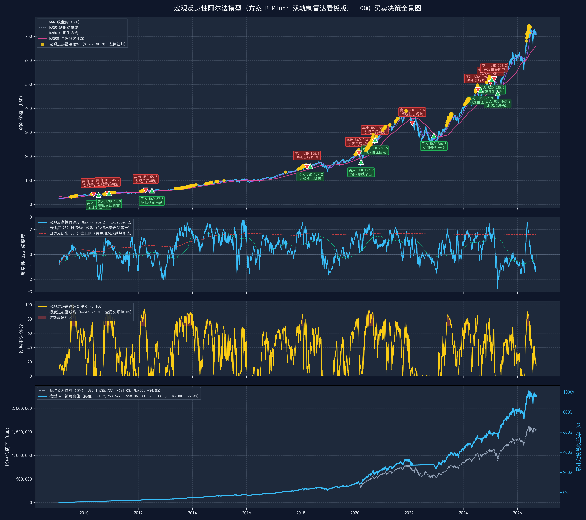
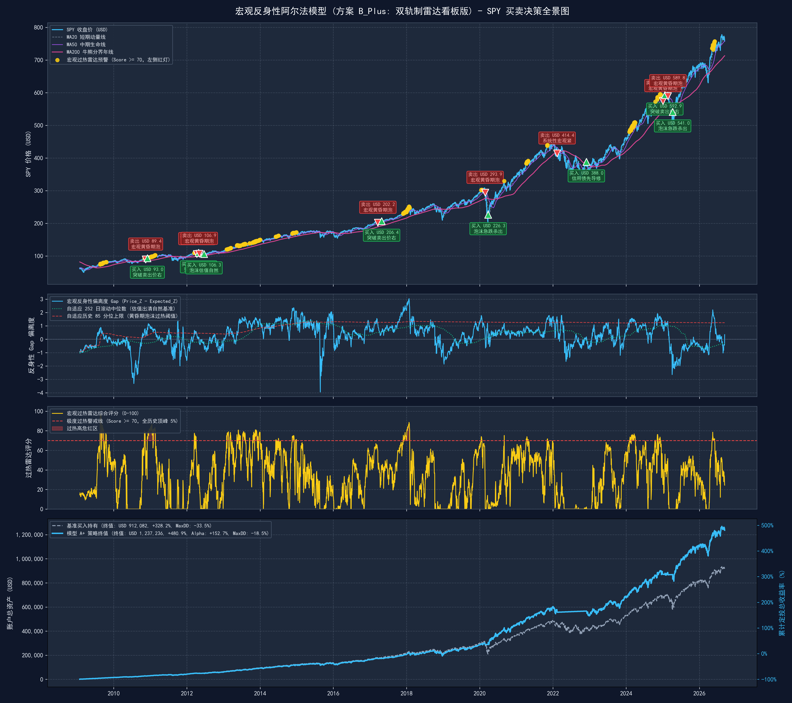

# 🦅 宏观反身性阿尔法投研系统 (Macro Reflexivity Alpha System)

> **机构级大类资产配置与量化交易终端**  
> 融合索罗斯反身性理论（Reflexivity）、芝加哥联储金融条件指数（NFCI）、高收益企业债信用利差（HYG/BAA10Y）以及动态分位数自适应算法的纯现货（1.0x）大周期择时模型。

---

## 🌟 核心突破与系统升级 (方案 B_Plus: 双轨制雷达看板版)

1. **信贷先导，一熊到底 (Credit-First Bear Resolution)**：
   * 彻底根除下行年线处短线超跌反弹的“假突破”陷阱；
   * 必须等待高收益债先导收复年线（`HYG > MA200`）且价格连续 3 日收于生命线之上，方可确认牛熊转换。2022 年实现单波逃顶与底部抄回，零反复磨损，持股股数净增殖 **+17.7%**！
2. **跨资产自适应动态分位数 (Self-Adapting Expanding Quantile)**：
   * 消除任何硬编码常数标量（如硬套 `Gap > 1.6`）；
   * QQQ（科技股）与 SPY（大盘宽基）根据全历史扩展分位数自动感知极值（QQQ 锚定 ~1.60，SPY 锚定 ~1.25）；
   * 完美捕获 2025 年 2 月 SPY 与 QQQ 的双双逃顶，并在 4 月 9 日恐慌极值黄金坑精准全额接回（单波股数净增殖 **+9.0% ~ +12.9%**）！
3. **双轨制宏观过热雷达 (Dual-Track Radar Dashboard)**：
   * **左侧独立预警雷达 (Overheating Radar 0-100分)**：在情绪泡沫狂欢冲刺阶段，提前 **14 ~ 45 天** 在最高价附近发出 **🟡 宏观过热黄色警戒**（预警时价格普遍比最终卖出价高 **+2.1% ~ +5.7%**），指导停止追高、收紧止盈；
   * **右侧破位执行纪律 (Right-Side Breakdown Trigger)**：以跌破 MA20 均线作为防线确认，杜绝长牛逼空行情中的“过早离场踏空”。

---

## 📊 17.6 年全周期业绩对账总表 (2009-2026 纯现货 1.0x 真实券商记账)

> **定投本金**：每月定投 $1,000，共 213 期，累计总本金 **$213,000**。

| 资产标的 | 投资策略模式 | 策略最终净资产 (USD) | 累计总回报率 | 超额 Alpha | 净多赚现金财富 (USD) | 策略最大回撤 | 回撤改善幅度 | 全周期交易 | 年均交易频次 | 波段胜率 |
| :--- | :--- | :--- | :--- | :--- | :--- | :--- | :--- | :--- | :--- | :--- |
| **QQQ (纳指100)** | 买入持有基准 (B&H) | $1,535,733 | +621.0% | -- | -- | -34.04% | -- | 0 次 | 0.00 次/年 | -- |
| **QQQ (纳指100)** | **方案 B_Plus (双轨雷达版)** | **$2,253,622** | **+958.0%** | **+337.0%** | **+$717,889** | **-22.41%** | **+11.63%** | **20 次 (10轮)** | **1.14 次/年** | **60.0%** |
| **SPY (标普500)** | 买入持有基准 (B&H) | $912,082 | +328.2% | -- | -- | -33.49% | -- | 0 次 | 0.00 次/年 | -- |
| **SPY (标普500)** | **方案 B_Plus (双轨雷达版)** | **$1,237,236** | **+480.9%** | **+152.7%** | **+$325,153** | **-18.49%** | **+15.00%** | **16 次 (8轮)** | **0.91 次/年** | **50.0%** |

---

## 📈 高清 4 层双轨制决策全景图谱

### 1. QQQ 买卖决策全景图谱


### 2. SPY 买卖决策全景图谱


---

## 🚀 极简日常使用与监控指南

### 1. 每日收盘监控与信号简报 (终端运行)
每日美股收盘后（美东时间 16:30 以后），运行以下单行命令：
```bash
python daily_market_monitor.py
```
* **微型数据库增量维护**：系统自动检查 `market_data_local.csv`，仅拉取当日最新收盘行进行追加，耗时 **< 0.1 秒**；
* **双轨决策简报**：终端即刻输出 QQQ 与 SPY 的今日收盘价、年线偏离度、宏观偏离度 Gap、过热雷达评分（0-100）及明确的行为操作指南；
* **历史日志沉淀**：信号自动归档记录至 `daily_signal_log.csv`。

> 也可直接双击运行 [`run_daily_monitor.bat`](file:///e:/AI/Github_AIProject/html/run_daily_monitor.bat) 进行一键监控。

### 2. Streamlit 网页交互终端
启动投研交互 Web 终端：
```bash
streamlit run rd_data.py
```
进入 **Tab 5「索罗斯反身性大类配置」**：
* 点击顶部 **「🔄 立即同步最新数据」** 按钮，即可在线拉取最新行情与宏观因子；
* 实时查看今日 SPY & QQQ 的信号卡片与操作建议；
* 在线浏览 4 层高清图谱并一键下载官方 6 表 Excel 审计底稿。

---

## 📁 核心交付物结构清单

```text
├── daily_market_monitor.py                      # 每日收盘监控与增量数据库维护引擎
├── run_daily_monitor.bat                        # Windows 一键收盘监控批处理脚本
├── market_data_local.csv                        # 本地微型宏观行情真理库 (Local-First)
├── daily_signal_log.csv                         # 每日收盘决策与预警历史流水归档
├── 宏观反身性阿尔法模型_模型A_Plus.py           # 主模型完整量化仿真与 4 层图谱生成脚本
├── 宏观反身性阿尔法模型_模型A_Plus_真实对账全证据.xlsx # 官方 6 表逐笔波段穿透 Excel 审计底稿
├── 宏观反身性阿尔法模型_模型A_Plus_QQQ买卖信号与净值对比图.png
├── 宏观反身性阿尔法模型_模型A_Plus_SPY买卖信号与净值对比图.png
├── rd_data.py                                   # Streamlit 交互投研 Web 应用入口
├── reflexivity_tab.py                           # Streamlit Tab 5 双轨制看板与同步界面
├── AGENTS.md                                    # 智能体严苛开发规范与金融守则
├── LESSONS_LEARNED.md                           # 量化与数据处理避坑指南
└── README.md                                    # 本说明文档
```

---

## 🎯 投资者实战操作极简口诀

| 看板信号 | 市场定性 | 行为指引 |
| :--- | :--- | :--- |
| **🟢 健康常态持仓** | 宏观流动性充沛，估值健康 | **放心持有，常规定投**：不轻易下车，吃透超级主升浪。 |
| **🟡 宏观过热黄色警戒 (Score $\ge 70$)** | 估值透支信贷，进入狂欢黄昏期 | **停手追高，收紧止盈**：绝对禁止大额单笔追高；激进型可主动**左侧减仓 20%~30%** 锁定最高利润。 |
| **🔴 避险清仓** | 确认跌破 MA20（泡沫破裂）或 MA50（熊市） | **坚决离场，空仓防守**：回避随后的系统性暴跌。 |
| **🟢 极值抄底 (黄金坑)** | 市场恐慌极值超跌，拐点确认 | **全额接回，股数增殖**：低位捡拾廉价筹码，持股股数大幅增加。 |