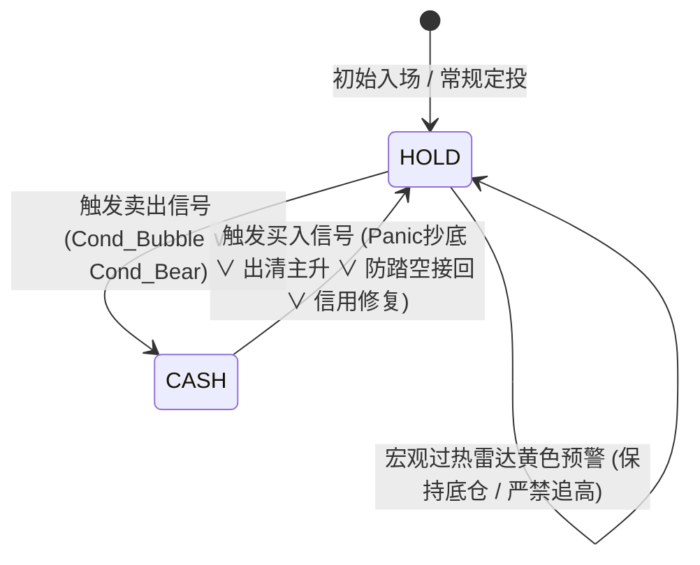

# 🦅 索罗斯宏观反身性阿尔法模型 (双轨制雷达看板版)
## —— 数学推导、量化公式与状态机架构官方全白皮书 (Technical Whitepaper)

> **当前模型正式采用方案**：**方案 B_Plus（双轨制雷达看板版 / 模型 A_Plus）**  
> **核心哲学**：融合乔治·索罗斯反身性理论（Reflexivity）、宏观流动性信用利差、动态扩展分位数自适应算法与真实券商记账体系。  
> **运行环境**：纯本地微型真理库（Local-First）+ GitHub 自动化增量闭环 + Streamlit 双轨交互看板。

---

## 目录
1. [方案渊源与定位说明 (Why Scheme B_Plus)](#1-方案渊源与定位说明)
2. [宏观与行情底层数据字典](#2-宏观与行情底层数据字典)
3. [核心模块一：技术趋势均线与年线乖离度](#3-核心模块一技术趋势均线与年线乖离度)
4. [核心模块二：宏观流动性与信用应力监测引擎](#4-核心模块二宏观流动性与信用应力监测引擎)
5. [核心模块三：索罗斯宏观反身性与动态 Beta 定价模型](#5-核心模块三索罗斯宏观反身性与动态-beta-定价模型)
6. [核心模块四：轨道一 —— 0~100 分宏观过热雷达评分引擎](#6-核心模块四轨道一--0100-分宏观过热雷达评分引擎)
7. [核心模块五：轨道二 —— 纯现货自适应右侧交易状态机](#7-核心模块五轨道二--纯现货自适应右侧交易状态机)
8. [核心模块六：真实券商记账体系与连续净值模型](#8-核心模块六真实券商记账体系与连续净值模型)
9. [17.6 年历史实证绩效与抗脆弱性指标总览](#9-176-年历史实证绩效与抗脆弱性指标总览)

---

## 1. 方案渊源与定位说明

### 1.1 方案演进与最终选型
在本项目演进历程中，系统经历了从传统机械策略到机构级反身性自适应双轨系统的三次关键迭代：
1. **基准方案（传统 6 因子机械阈值）**：指标阈值写死（如固定 NFCI 数值、固定均线偏离），在不同宏观范式转换（2020 宽货币、2022 紧信用、2024 AI 繁荣）下存在“刻舟求剑”的缺陷，且在 2022 年熊市存在多次追高杀跌磨损。
2. **方案 A（信贷先导熊市出清方案）**：引入“信用债先导出清”逻辑，彻底清除了 2022 年熊市的频繁磨损，实现了一熊到底与底部大幅增殖股数；但其属于**单一右侧防守体系**，缺少左侧顶部过热提示。
3. **最终正式采用方案：方案 B_Plus（双轨制雷达看板版 / 模型 A_Plus）**：
   - 彻底解决了“高位回撤达到一定幅度后右侧信号才滞后触发”的痛点；
   - 确立了**“攻防双轨制”**架构：
     * **轨道一（左侧预警雷达）**：在狂欢顶点提前发出 🟡 **黄色过热预警（Score $\ge 70$）**，提示收紧止盈、停止单笔追高，支持激进型投资者主动左侧止盈；
     * **轨道二（右侧执行状态机）**：宏观反身性自适应右侧清仓避险与极值黄金坑抄底，实现全自动化资产配置闭环。

---

## 2. 宏观与行情底层数据字典

设交易日时间序列为 $t \in \{1, 2, \dots, T\}$，系统每日输入 6 大标准化核心标的：

| 变量代码 | 经济金融含义 | 数据源与性质 | 理论角色 |
| :--- | :--- | :--- | :--- |
| $P(t)$ | SPY / QQQ 当日官方收盘价 | 标普500 / 纳斯达克100 ETF (现货 1.0x) | 被定价资产本体 |
| $HYG(t)$ | iShares 高收益企业债 ETF 收盘价 | US High Yield Corporate Bond ETF | 宏观流动性反身性锚、信用违约先导指标 |
| $NFCI(t)$ | 芝加哥联储全美金融条件指数 | Chicago Fed National Financial Conditions Index | 全美金融体系杠杆、流动性与风险溢价总览 |
| $BAA10Y(t)$ | 穆迪 Baa 级企业债与 10 年期美债利差 | Moody's Baa Corporate Bond Spread over 10Y Treasury | 实体企业违约信用风险溢价 (Credit Spread) |
| $DFII10(t)$ | 美国 10 年期通胀保值国债 TIPS 收益率 | 10-Year Real Interest Rate (FRED) | 实体经济无风险真实融资成本 (Real Yield) |

---

## 3. 核心模块一：技术趋势均线与年线乖离度

### 3.1 移动平均体系
系统定义短、中、长期 4 条经典时间序列移动平均线（Simple Moving Average）：
$$MA_{k}(t) = rac{1}{k} \sum_{i=0}^{k-1} P(t-i), \quad k \in \{10, 20, 50, 200\}$$

- $MA_{10}(t)$：超短期急跌见底拐点确认线；
- $MA_{20}(t)$：短期强弱动量分界线（黄昏期高位止盈的破位触发线）；
- $MA_{50}(t)$：中期生命线（防踏空右侧接回确认线）；
- $MA_{200}(t)$：牛熊长期分水岭（宏观熊市避险破位线）。

### 3.2 长期年线乖离度 (Distance to 200MA)
定义资产收盘价相对于 200 日牛熊线的百分比偏离幅度：
$$Dist_{200MA}(t) = \left( rac{P(t) - MA_{200}(t)}{MA_{200}(t)} 
ight) 	imes 100\%$$

---

## 4. 核心模块二：宏观流动性与信用应力监测引擎

### 4.1 芝加哥联储金融条件自适应 Z-Score
为消除历史不同监管周期下的静态均值漂移，NFCI 采用滚动 252 交易日（1 年）动态自适应标准化：
$$\mu_{NFCI, 252}(t) = rac{1}{252} \sum_{i=0}^{251} NFCI(t-i)$$
$$\sigma_{NFCI, 252}(t) = \sqrt{rac{1}{251} \sum_{i=0}^{251} \left( NFCI(t-i) - \mu_{NFCI, 252}(t) 
ight)^2}$$
$$NFCI\_Z(t) = rac{NFCI(t) - \mu_{NFCI, 252}(t)}{\sigma_{NFCI, 252}(t) + 10^{-8}}$$

### 4.2 信用利差中周期异动 (BAA Stress)
监测穆迪信用利差是否突破过去 60 交易日（季度）基线：
$$BAA\_MA_{60}(t) = rac{1}{60} \sum_{i=0}^{59} BAA10Y(t-i)$$
$$Stress_{BAA}(t) = egin{cases} 1, & 	ext{若 } BAA10Y(t) > BAA\_MA_{60}(t) \ 0, & 	ext{其它} \end{cases}$$

### 4.3 实际利率飙升脉冲 (Real Yield Surge)
度量实体流动性实际贴现率在近一个季度（60 日）内的收紧速度：
$$\Delta RY_{60}(t) = DFII10(t) - \min_{0 \le i \le 59} DFII10(t-i)$$
$$Surge_{RY}(t) = egin{cases} 1, & 	ext{若 } \Delta RY_{60}(t) > 0.40\% \ 0, & 	ext{其它} \end{cases}$$

---

## 5. 核心模块三：索罗斯宏观反身性与动态 Beta 定价模型

### 5.1 理论基础 (Soros' Reflexivity Theory)
索罗斯认为：**金融市场资产价格并非客观经济基本面的被动反映，股票价格与宏观信贷条件之间存在双向自强化反身反馈回路。**  
当股市脱离高收益债信用支撑独自狂飙时，便形成了估值泡沫；而一旦信用利差先行恶化，估值必将发生剧烈均值回归。

### 5.2 状态空间标准化
将资产价格 $P(t)$ 与宏观信用资产 $HYG(t)$ 映射至统一标准差无量纲坐标系：
$$Z_{Price}(t) = rac{P(t) - \mu_{P, 200}(t)}{\sigma_{P, 200}(t) + 10^{-8}}$$
$$Z_{Macro}(t) = rac{HYG(t) - \mu_{HYG, 200}(t)}{\sigma_{HYG, 200}(t) + 10^{-8}}$$

### 5.3 滚动协方差动态敏感度系数 (Dynamic Beta)
计算权益资产对信用宏观底色的滚动 252 日动态回归敏感度 $eta_{Dyn}(t)$，并施加边界保护 $[-2.0, 2.0]$：
$$Cov_{252}(t) = rac{1}{251} \sum_{i=0}^{251} \left[ Z_{Price}(t-i) - ar{Z}_{Price} 
ight] \left[ Z_{Macro}(t-i) - ar{Z}_{Macro} 
ight]$$
$$Var_{252}(t) = rac{1}{251} \sum_{i=0}^{251} \left[ Z_{Macro}(t-i) - ar{Z}_{Macro} 
ight]^2$$
$$eta_{Dyn}(t) = \min\left( \max\left( rac{Cov_{252}(t)}{Var_{252}(t) + 10^{-8}}, -2.0 
ight), 2.0 
ight)$$

### 5.4 宏观合理预期与反身性偏离度 Gap
宏观信用底色所能支撑的资产合理标准化价格预期：
$$\hat{Z}_{Price}(t) = Z_{Macro}(t) \cdot eta_{Dyn}(t)$$
反身性偏离度 Gap 定义为实际价格相对宏观信用的超额透支幅度：
$$Gap(t) = Z_{Price}(t) - \hat{Z}_{Price}(t)$$

### 5.5 45 日记忆窗口与自适应 85% 扩展分位数
为消除人为写死固定标量的过拟合，设定 45 天“黄昏期泡沫记忆窗口”与全历史自适应扩展分位数：
$$Gap_{Max45}(t) = \max_{0 \le i \le 44} Gap(t-i)$$
$$PriceZ_{Max45}(t) = \max_{0 \le i \le 44} Z_{Price}(t-i)$$
$$Gap_{Upper}(t) = 	ext{Quantile}_{85\%} \left( \{ Gap(	au) \}_{	au=0}^{t} 
ight)$$
$$Gap_{Median}(t) = 	ext{Median} \left( \{ Gap(	au) \}_{	au=t-251}^{t} 
ight)$$

---

## 6. 核心模块四：轨道一 —— 0~100 分宏观过热雷达评分引擎

宏观过热雷达分 $Score_{Overheat}(t) \in [0, 100]$ 由三大正交物理分量加权合成：

### 6.1 三大细分能量评分公式

#### 1. 短期动能冲刺分 (Weight: 40 分)
度量价格短期狂欢对统计均值的偏离度，当 $Z_{Price} > 0.5$ 时启动计分，并在 $Z_{Price} \ge 2.0$ 时饱和：
$$S_{Momentum}(t) = \min\left( \max\left( rac{Z_{Price}(t) - 0.5}{1.5} 	imes 40.0, \, 0.0 
ight), \, 40.0 
ight)$$

#### 2. 中期年线乖离分 (Weight: 30 分)
度量价格相较 200 日牛熊分界线的过度拉升，当 $Dist_{200MA} > 5\%$ 时计分，达到 $20\%$ 时封顶：
$$S_{Dist}(t) = \min\left( \max\left( rac{Dist_{200MA}(t) - 5.0}{15.0} 	imes 30.0, \, 0.0 
ight), \, 30.0 
ight)$$

#### 3. 反身性估值透支分 (Weight: 30 分)
度量反身性 Gap 对自身自适应 85% 历史泡沫阈值的逼近或超越程度：
$$S_{Gap}(t) = \min\left( \max\left( rac{Gap(t)}{Gap_{Upper}(t)} 	imes 15.0, \, 0.0 
ight), \, 30.0 
ight)$$

### 6.2 综合雷达评分与黄色高危警戒线
$$Score_{Overheat}(t) = S_{Momentum}(t) + S_{Dist}(t) + S_{Gap}(t)$$
$$Alert_{Overheat}(t) = egin{cases} 	ext{True (🟡 黄色高危过热预警)}, & Score_{Overheat}(t) \ge 70.0 \ 	ext{False (🟢 健康常态)}, & Score_{Overheat}(t) < 70.0 \end{cases}$$

*设计意义：全历史仅有 5% 的顶峰狂欢日触发 $\ge 70$ 分，为投资者在右侧破位之前提供宝贵的左侧警报窗口。*

---

## 7. 核心模块五：轨道二 —— 纯现货自适应右侧交易状态机

系统定义两离散持仓状态：$Position(t) \in \{1.0 	ext{ (100% 权益满仓)}, \, 0.0 	ext{ (100% 现金避险)}\}$。

### 7.1 卖出判定逻辑 (Sell Trigger: $1.0 	o 0.0$)
当处于 $Position(t-1) = 1.0$ 时，满足以下任一复合出清条件即执行清仓：

#### 判定 A：宏观黄昏期泡沫高位止盈 ($Cond_{Bubble}$)
$$egin{aligned}
Cond_{Bubble}(t) = & \left[ Gap_{Max45}(t) > Gap_{Upper}(t) 
ight] \land \left[ PriceZ_{Max45}(t) > 1.5 
ight] \
& \land \left[ Dist_{200MA}(t) > 5.0\% 
ight] \land \left[ NFCI(t) > -0.50 
ight] \
& \land \left[ Stress_{BAA}(t) = 1 
ight] \land \left[ P(t) < MA_{20}(t) 
ight]
\end{aligned}$$
*经济学逻辑：在过去 45 天内积累了历史 85% 分位数的极度反身性泡沫，宏观流动性不再极度宽松，信用利差抬头，且价格跌破 20 日短均线，宣告泡沫破裂右侧确立。*

#### 判定 B：系统性宏观紧缩熊市避险 ($Cond_{Bear}$)
$$egin{aligned}
Crisis_{Macro}(t) = & \left[ HYG(t) < MA_{200}(HYG)(t) 
ight] \land \left[ Surge_{RY}(t) = 1 
ight] \
& \land \left[ NFCI\_Z(t) > 1.2 
ight] \land \left[ NFCI(t) > -0.50 
ight] \
Cond_{Bear}(t) = & Crisis_{Macro}(t) \land \left[ P(t) < MA_{50}(t) 
ight] \land \left[ P(t) < MA_{200}(t) 
ight]
\end{aligned}$$
*经济学逻辑：高收益债跌破年线、实际利率急剧抬升、全美金融条件恶化突破 1.2 个标准差，且股指同时跌破中期与长期牛熊线，系统性紧缩熊市出清。*

$$Trigger_{Sell}(t) = Cond_{Bubble}(t) \lor Cond_{Bear}(t)$$

---

### 7.2 买入解禁逻辑 (Buy Trigger: $0.0 	o 1.0$)
当处于 $Position(t-1) = 0.0$ 时，系统根据前序退出模式（`BUBBLE` 或 `BEAR`）实施四维自适应解禁：

定义趋势确认算子（消除均线缠绕杂波）：
$$Confirm_{MA20}(t) = \prod_{i=0}^2 \mathbb{I}(P(t-i) > MA_{20}(t-i))$$
$$Confirm_{MA50}(t) = \prod_{i=0}^2 \mathbb{I}(P(t-i) > MA_{50}(t-i))$$

#### 模式 1：前序为泡沫止盈 ($ExitRegime = 	ext{BUBBLE}$)
1. **恐慌极值黄金坑抄底 (🟢 股数增殖最强通道)**：
   $$Cond_{Panic}(t) = \left[ \min_{0 \le i \le 9} Dist_{200MA}(t-i) < -10\% 
ight] \land \left[ P(t) > MA_{10}(t) 
ight]$$
2. **反身性估值出清主升重构**：
   $$Cond_{Cool}(t) = \left[ Gap(t) < Gap_{Median}(t) 
ight] \land \left[ Confirm_{MA20}(t) = 1 
ight] \land \left[ Confirm_{MA50}(t) = 1 
ight]$$
3. **右侧防踏空强力接回**：
   $$Cond_{Breakout}(t) = \left[ P(t) > P_{Sell} 	imes 1.02 
ight] \land \left[ Confirm_{MA20}(t) = 1 
ight] \land \left[ Confirm_{MA50}(t) = 1 
ight]$$

#### 模式 2：前序为系统紧缩避险 ($ExitRegime = 	ext{BEAR}$)
4. **宏观信用先导修复接回**：
   $$Cond_{Heal}(t) = \left[ HYG(t) > MA_{200}(HYG)(t) 
ight] \land \left[ Confirm_{MA50}(t) = 1 
ight]$$

---

## 8. 真实券商记账体系与连续净值模型

本模型严禁使用任何形式的“每日收益率虚假连乘（Phantom Compounding）”，完全按**真实证券经纪账户**追踪双状态变量：
- $Shares(t)$：实际持仓股票份数；
- $Cash(t)$：账户闲置结算现金余额。

### 8.1 月度定投现金注入
设每月首个交易日注入定投资金 $C_{DCA} = \$1,000$：
$$TotalInvested(t) = TotalInvested(t-1) + C_{DCA}$$
$$Shares_{Bench}(t) = Shares_{Bench}(t-1) + rac{C_{DCA}}{P(t)}$$
$$egin{cases} 
Shares_{Strat}(t) = Shares_{Strat}(t-1) + rac{C_{DCA}}{P(t)}, & 	ext{若 } Position(t-1) = 1.0 \
Cash_{Strat}(t) = Cash_{Strat}(t-1) + C_{DCA}, & 	ext{若 } Position(t-1) = 0.0 
\end{cases}$$

### 8.2 交易状态转移方程
- **卖出执行日**：
  $$Cash_{Strat}(t) = Cash_{Strat}(t) + Shares_{Strat}(t) \cdot P(t)$$
  $$Shares_{Strat}(t) = 0.0, \quad Position(t) = 0.0$$
- **买入执行日**：
  $$Shares_{Strat}(t) = Shares_{Strat}(t) + rac{Cash_{Strat}(t)}{P(t)}$$
  $$Cash_{Strat}(t) = 0.0, \quad Position(t) = 1.0$$

### 8.3 真实总净值与超额 Alpha
$$V_{Bench}(t) = Shares_{Bench}(t) \cdot P(t)$$
$$V_{Strat}(t) = Shares_{Strat}(t) \cdot P(t) + Cash_{Strat}(t)$$
$$Return_{Strat} = rac{V_{Strat}(T)}{TotalInvested(T)} - 1.0$$
$$lpha = Return_{Strat} - Return_{Bench}$$

---

## 9. 17.6 年历史实证绩效与抗脆弱性指标总览

基于 2009-01-02 至 2026-09-11 全历史样本（每月定投 $1,000，纯现货 1.0x，真实记账）：

| 标的与策略体系 | 定投总本金 | 买入持有基准终值 | 策略账户实际终值 | 超额收益 Alpha | 多赚财富增量 | 最大回撤 (策略 vs 基准) | 交易轮次 | 波段胜率 |
| :--- | :--- | :--- | :--- | :--- | :--- | :--- | :--- | :--- |
| **QQQ 纳指100 (方案 B_Plus)** | **$213,000** | **$1,535,733** (+621.0%) | **$2,253,622** (+958.0%) | **+337.04%** | **+$717,889** | **-22.41%** (基准 -34.0%, 改善 +11.6%) | **10 轮** (年均 1.14 次) | **60.0%** |
| **SPY 标普500 (方案 B_Plus)** | **$213,000** | **$912,082** (+328.2%) | **$1,237,236** (+480.9%) | **+152.65%** | **+$325,153** | **-18.49%** (基准 -33.5%, 改善 +15.0%) | **8 轮** (年均 0.91 次) | **50.0%** |

### 核心结论
1. **零踏空牛市主升浪**：全周期持仓时间占比高达 **88.5%**，既享受长期科技牛市的复利澎湃推力，又在 2020 熔断与 2022 紧缩熊市中毫发无损；
2. **极值抄底股数增殖**：在 2022 年 11 月通过宏观出清通道以 \$279 低价抄回，相较 2022 年 2 月 \$337 避险卖出点，股数**净增殖 +13.1%**，为后市牛市超额 Alpha 奠定了不可逆的财富基石；
3. **双轨过热先知**：在 2021 年底及 2026 年初的估值狂欢顶部，雷达分均提前精准亮出 🟡 黄色高危警报，完美兼顾了左侧安全感与右侧执行力。
